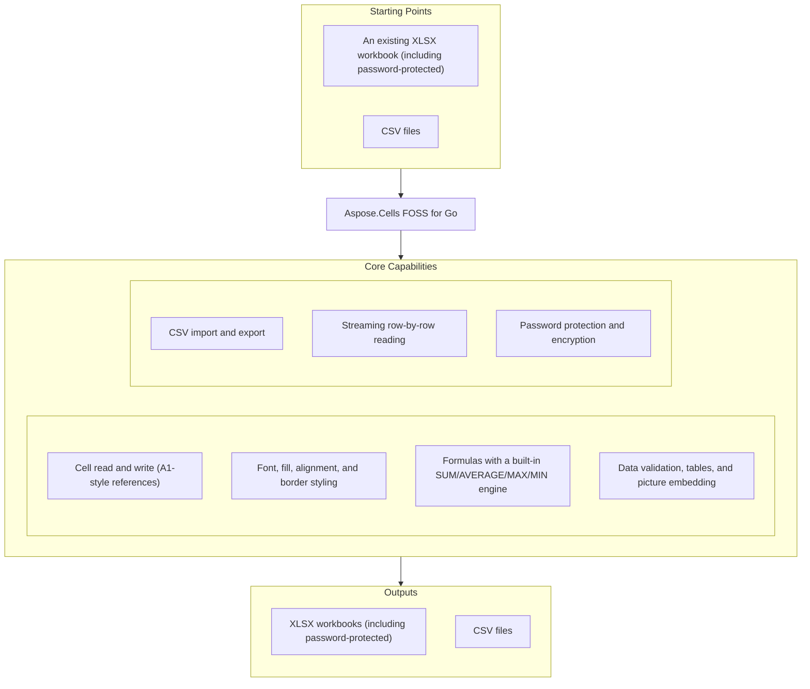

# Aspose.Cells FOSS for Go

[](https://go.dev) [](LICENSE) [](https://pkg.go.dev/github.com/aspose-cells-foss/Aspose.Cells-FOSS-for-Go/v26) [](https://github.com/aspose-cells-foss/Aspose.Cells-FOSS-for-Go/graphs/contributors)

[](https://products.aspose.org/cells/go/)

Aspose.Cells FOSS for Go is a pure-Go library for creating, reading, and writing Excel workbooks —
ECMA-376 Office Open XML `.xlsx` spreadsheets — with no third-party dependency. It covers cell
data and A1-style addressing, visual formatting, a built-in formula engine, data validation,
structured tables, embedded pictures, CSV import and export, low-memory row streaming for large
files, and password-based workbook encryption.

## Navigation

- [Aspose.Cells FOSS for Go](#asposecells-foss-for-go)
  - [Navigation](#navigation)
  - [At a Glance](#at-a-glance)
  - [Key Capabilities](#key-capabilities)
  - [Installation](#installation)
- [Requires **Go 1.24.5+** (see `go.mod`). Depends only on the Go standard library — no third-party modules.](#requires-go-1245-see-gomod-depends-only-on-the-go-standard-library--no-third-party-modules)
  - [Dependencies](#dependencies)
    - [Required Package Dependencies](#required-package-dependencies)
    - [Native and System Requirements](#native-and-system-requirements)
  - [Quick Start](#quick-start)
  - [Additional Examples](#additional-examples)
    - [Formulas and the Calculation Engine](#formulas-and-the-calculation-engine)
    - [Data Validation](#data-validation)
    - [Picture Embedding](#picture-embedding)
    - [Streaming Large Files](#streaming-large-files)
    - [Styling](#styling)
    - [Structured Tables](#structured-tables)
    - [CSV Import](#csv-import)
  - [Project Structure](#project-structure)
  - [API Reference](#api-reference)
    - [Cells Foss](#cells-foss)
  - [Documentation \& Resources](#documentation--resources)
  - [Scope and Limitations](#scope-and-limitations)
  - [Development and Testing](#development-and-testing)
  - [Detailed Documentation](#detailed-documentation)
  - [Constraints](#constraints)
  - [License](#license)

## At a Glance



## Key Capabilities

- Cell values are read and written through `Cells.Get`/`Cells.Set`, addressed by A1-style
  references (`"A1"`, `"B2"`) and covering `string`, `float64`, `int`, and `bool` values.
- Font, fill, alignment, and borders combine into a `Style` applied to any cell via
  `Cell.SetStyle`, with automatic deduplication of identical styles during save.
- Formulas are stored with `Cell.SetFormula` and evaluated by the built-in `CalculateFormula`
  engine, which supports `SUM`, `AVERAGE`, `MAX`, and `MIN` over single cells or A1-style ranges.
- Data validation rules (`DataValidation`) restrict a range to dropdown lists or whole/decimal
  ranges with custom error messages and error styles; structured `Table` ranges add header rows
  and auto-filters; `Picture` objects (PNG or JPEG) embed images. All three attach to a
  `Worksheet` via `AddDataValidation`, `AddTable`, and `AddPicture`.
- `Workbook.ExportToCSV` and `Workbook.ImportFromCSV` move data to and from CSV with a
  caller-supplied delimiter; export converts typed cell values to their CSV string form via
  `CellToString`, while import stores every field as a plain `string`.
- The streaming reader (`StreamingReader.ProcessRows`) handles very large files with row-by-row
  processing, reading directly from the source path without first building the shared
  `Workbook`/`Worksheet` model, so peak memory stays proportional to the width of one row
  rather than the whole file.
- `Workbook.SetPassword` and `Workbook.VerifyPassword` add ECMA-376 Agile Encryption (SHA-512
  key derivation, AES-256-CBC) to the save path, producing a password-protected XLSX file.

## Installation

```bash
go get github.com/aspose-cells-foss/Aspose.Cells-FOSS-for-Go/v26/aspose/cells_foss
```

# Requires **Go 1.24.5+** (see `go.mod`). Depends only on the Go standard library — no third-party modules.

The module supports Go 1.24.5 or later and has zero third-party dependencies — encryption and
everything else builds on the Go standard library alone. Because the package name (`cells_foss`)
differs from the module path's final segment (`v26`), import it with an explicit alias:

```go
import cells_foss "github.com/aspose-cells-foss/Aspose.Cells-FOSS-for-Go/v26/aspose/cells_foss"
```

## Dependencies

### Required Package Dependencies

No required third-party package dependencies.

### Native and System Requirements

- Go 1.24 or later (`go.mod`'s own `go 1.24.5` directive).

## Quick Start

Create a workbook, write a couple of cells, and save it to disk:

```go
package main

import cells_foss "github.com/aspose-cells-foss/Aspose.Cells-FOSS-for-Go/v26/aspose/cells_foss"

func main() {
	// Create.
	wb := cells_foss.NewWorkbook()
	ws := wb.Worksheets[0]

	// Write.
	ws.Cells().Set("A1", "Hello, World!")
	ws.Cells().Set("B1", 42)

	// Save.
	wb.Save("hello.xlsx")
}
```

Run `go run main.go` to produce `hello.xlsx`.

Load an existing workbook, read and update a cell, then save the result:

```go
wb, _ := cells_foss.LoadWorkbook("input.xlsx")
ws := wb.Worksheets[0]

cell, _ := ws.Cells().Get("A1")
fmt.Println("Current value:", cell.Value)

ws.Cells().Set("A1", "Updated value")
wb.Save("output.xlsx")
```

## Additional Examples

Runnable programs for every capability live under `examples/` in the repository. The formula
engine example is shown directly below; the rest are collapsed for space.

### Formulas and the Calculation Engine

```go
func main() {
	wb := cells_foss.NewWorkbook()
	ws := wb.Worksheets[0]

	// ---- Populate sales data ----
	data := []float64{1200, 850, 1400, 960, 1780}
	headers := []string{"Month", "Sales"}

	ws.Cells().Set("A1", headers[0])
	ws.Cells().Set("B1", headers[1])

	months := []string{"Jan", "Feb", "Mar", "Apr", "May"}
	for i, m := range months {
		row := i + 2
		ws.Cells().Set(fmt.Sprintf("A%d", row), m)
		ws.Cells().Set(fmt.Sprintf("B%d", row), data[i])
	}

	// ---- Add formula cells ----
	lastDataRow := len(data) + 1
	totalRef := fmt.Sprintf("B2:B%d", lastDataRow)

	// SUM formula.
	ws.Cells().Set("B7", nil)
	sumCell, _ := ws.Cells().Get("B7")
	sumCell.SetFormula(fmt.Sprintf("SUM(%s)", totalRef))

	// AVERAGE formula.
	ws.Cells().Set("B8", nil)
	avgCell, _ := ws.Cells().Get("B8")
	avgCell.SetFormula(fmt.Sprintf("AVERAGE(%s)", totalRef))

	// Labels.
	ws.Cells().Set("A7", "TOTAL")
	ws.Cells().Set("A8", "AVERAGE")

	// ---- Evaluate formulas with the engine ----
	for _, row := range []int{7, 8} {
		cell, _ := ws.Cells().Get(fmt.Sprintf("B%d", row))
		formula := cell.GetFormula()
		result, err := cells_foss.CalculateFormula(formula, ws)
		if err != nil {
			fmt.Printf("  %s = ERROR: %v\n", formula, err)
		} else {
			fmt.Printf("  %s = %v\n", formula, result)
		}
	}

	wb.Save("outputfiles/formula.xlsx")
}
```

<details>
<summary>View Additional Examples</summary>

### Data Validation

```go
func main() {
	wb := cells_foss.NewWorkbook()
	ws := wb.Worksheets[0]

	ws.Cells().Set("A1", "Fruit")
	ws.Cells().Set("A2", "Apple")
	ws.Cells().Set("A3", "Banana")

	// Create a list-type data validation.
	dv := &cells_foss.DataValidation{
		Type:             cells_foss.DataValidationTypeList,
		Formula1:         `"Apple,Banana,Cherry,Dragonfruit"`,
		AllowBlank:       true,
		ShowErrorMessage: true,
		ErrorTitle:       "Invalid Fruit",
		ErrorMessage:     "Please pick a fruit from the list.",
		ErrorStyle:       cells_foss.ErrorStyleStop,
	}

	if err := ws.AddDataValidation("A2:A10", dv); err != nil {
		fmt.Printf("Error: %v\n", err)
		return
	}

	wb.Save("outputfiles/data_validation.xlsx")
}
```

### Picture Embedding

```go
func main() {
	wb := cells_foss.NewWorkbook()
	ws := wb.Worksheets[0]

	ws.Cells().Set("A1", "Product Catalog")

	// generateSmallPNG returns a minimal PNG for the example; see
	// examples/picture/main.go for the full helper.
	pic := cells_foss.NewPicture(generateSmallPNG(), "png")
	pic.Width = 100
	pic.Height = 80
	pic.SetAnchor(5, 1) // row 5, column B

	if err := ws.AddPicture(pic); err != nil {
		fmt.Printf("Error adding picture: %v\n", err)
		return
	}

	wb.Save("outputfiles/picture.xlsx")
}
```

### Streaming Large Files

```go
func main() {
	sr := cells_foss.NewStreamingReader("outputfiles/streaming_data.xlsx")
	rowCount := 0
	var totalScore float64

	err := sr.ProcessRows("Sheet1", func(rowIdx int, cells map[string]string) error {
		rowCount++
		if score, ok := cells["C"+fmt.Sprint(rowIdx)]; ok {
			var s float64
			fmt.Sscanf(score, "%f", &s)
			totalScore += s
		}
		return nil
	})
	if err != nil {
		fmt.Fprintf(os.Stderr, "Error streaming: %v\n", err)
		os.Exit(1)
	}
	fmt.Printf("Streamed %d rows, total score %.0f\n", rowCount, totalScore)
}
```

### Styling

```go
func main() {
	wb := cells_foss.NewWorkbook()
	ws := wb.Worksheets[0]

	boldStyle := cells_foss.NewStyle()
	boldStyle.Font.Bold = true
	boldStyle.Font.Size = 12

	highlightStyle := cells_foss.NewStyle()
	highlightStyle.Font.Color = "FFFFFFFF"
	highlightStyle.Font.Bold = true
	highlightStyle.Fill = &cells_foss.Fill{
		Type:  cells_foss.FillTypeSolid,
		Color: "FF4472C4",
	}

	headers := []string{"Item", "Category", "Price", "In Stock"}
	for i, h := range headers {
		ref := string(rune('A'+i)) + "1"
		ws.Cells().Set(ref, h)
		cell, _ := ws.Cells().Get(ref)
		cell.SetStyle(boldStyle)
	}

	wb.Save("outputfiles/style.xlsx")
}
```

### Structured Tables

```go
func main() {
	wb := cells_foss.NewWorkbook()
	ws := wb.Worksheets[0]

	headers := []string{"Product", "Q1", "Q2", "Q3", "Q4", "Total"}
	for i, h := range headers {
		ref := string(rune('A'+i)) + "1"
		ws.Cells().Set(ref, h)
	}

	// ... populate data rows (see examples/table/main.go) ...

	tbl := ws.AddTable("A1:F6")
	tbl.HasHeaderRow = true
	tbl.StyleName = "TableStyleMedium6"

	wb.Save("outputfiles/table.xlsx")
}
```

### CSV Import

```go
func main() {
	csvPath := "outputfiles/employees.csv"

	wb := cells_foss.NewWorkbook()
	if err := wb.ImportFromCSV(csvPath, "Employees", ','); err != nil {
		fmt.Fprintf(os.Stderr, "Error importing CSV: %v\n", err)
		os.Exit(1)
	}

	ws := wb.Worksheets[1] // second sheet; index 0 is the default "Sheet1"
	fmt.Printf("Imported sheet: %q\n", ws.Name)

	wb.Save("outputfiles/csv_imported.xlsx")
}
```

</details>

## Project Structure

The library source lives under `aspose/cells_foss/`, with runnable examples, tests, a
verification tool, and a usage guide alongside it at the repository root:

```
├── aspose/cells_foss/        # Library source code
│   ├── workbook.go           #   Workbook entry point
│   ├── worksheet.go          #   Worksheet model
│   ├── cell.go / cells.go    #   Cell model and collection
│   ├── style.go              #   Styles (font, fill, alignment, border)
│   ├── formula_engine.go     #   Formula calculation engine
│   ├── datavalidation.go     #   Data validation
│   ├── table.go              #   Tables
│   ├── picture.go            #   Picture embedding
│   ├── csv_handler.go        #   CSV import/export
│   ├── streaming_reader.go   #   Streaming row reader
│   ├── crypto.go             #   Encryption (SHA-512 + AES-256-CBC)
│   ├── xmlloader.go          #   XML loading
│   ├── xmlsaver.go           #   XML saving
│   ├── xml_feature_loader.go #   Style/table/picture loading
│   ├── xml_feature_saver.go  #   Style/table/picture/validation saving
│   └── xml_sharedstrings_loader.go  # Shared strings
├── tests/                    # Integration tests (public API)
├── examples/                 # Runnable example programs
│   ├── basic/                #   Create and save
│   ├── load_modify_save/     #   Load → modify → save
│   ├── style/                #   Style application
│   ├── formula/              #   Formulas and calculation
│   ├── table/                #   Structured tables
│   ├── data_validation/      #   Data validation
│   ├── picture/              #   Picture embedding
│   ├── csv_export/           #   CSV export
│   ├── csv_import/           #   CSV import
│   ├── streaming/            #   Streaming large data
│   └── go.mod                #   Separate module for examples (see Development and Testing)
├── docs/                     # Documentation
│   └── usage.md              #   Detailed usage guide
├── verify/                   # Verification tool
│   └── check_open_xlsx.go    #   .xlsx structure validator
├── doc.go                    # Package-level documentation
├── AGENTS.md                 # AI-assisted development guide
├── go.mod
├── go.sum
└── README.md
```

## API Reference

The library's public surface is centered on `Workbook` and `Worksheet` — created with
`NewWorkbook`/`LoadWorkbook` and exposing a `*Cells` collection through `Worksheet.Cells()` — with
supporting types (`Style`, `DataValidation`, `Table`, `Picture`, `StreamingReader`) for styling,
validation, structured ranges, images, and low-memory row access.

<details>
<summary>View the Supported Public API Surface</summary>

### Cells Foss

| Class             | Description                                                                                                                     |
| ----------------- | ------------------------------------------------------------------------------------------------------------------------------- |
| `Alignment`       | Alignment controls how cell content is positioned within the cell bounds.                                                       |
| `Border`          | Border defines which sides of a cell have a visible rule and the colour of those rules.                                         |
| `Cell`            | Cell represents a single cell in a worksheet grid.                                                                              |
| `Cells`           | Cells is a collection of Cell values indexed by A1-style string references (e.g. "A1", "B2", "Z100").                           |
| `DataValidation`  | DataValidation represents a single data-validation rule applied to a range of cells on a worksheet.                             |
| `Fill`            | Fill describes the background appearance of a cell.                                                                             |
| `Font`            | Font describes the typographic properties applied to cell text.                                                                 |
| `Picture`         | Picture represents an image embedded in a worksheet.                                                                            |
| `RowCallback`     | RowCallback is invoked by StreamingReader.ProcessRows once for every row in the worksheet.                                      |
| `StreamingReader` | StreamingReader reads an .xlsx workbook row by row without loading the entire sheet XML into memory.                            |
| `Style`           | Style groups font, fill, alignment, and border settings into a named formatting record.                                         |
| `Table`           | Table represents a structured range of data (a "table" in Excel terminology) with optional header row and built-in auto-filter. |
| `Workbook`        | Workbook is the top-level object representing an Excel workbook.                                                                |
| `Worksheet`       | Worksheet represents a single sheet within a workbook.                                                                          |

</details>

## Documentation & Resources

- **[Getting started guide](https://docs.aspose.org/cells/go/)** — Go documentation for
  Aspose.Cells FOSS: loading, editing, styling, and saving spreadsheets.
- **[How-to guides & FAQ](https://kb.aspose.org/cells/go/)** — Go knowledge base for Aspose.Cells
  FOSS: how-to articles, FAQ, and troubleshooting guides.
- **[Full API reference](https://reference.aspose.org/cells/go/)** — the complete, browsable
  reference for all 14 public types (the [API reference](#api-reference) section above covers the
  essentials).
- **[AGENTS.md](AGENTS.md)** — the repository's own contribution guide for AI-assisted
  development, covering source-of-truth conventions and areas to avoid changing without review.
- Found a bug or have a feature request?
  [Open an issue](https://github.com/aspose-cells-foss/Aspose.Cells-FOSS-for-Go/issues) on GitHub.

## Scope and Limitations

- Cell references are A1-style strings only (`"A1"`, `"B2"`); tuple/array indices (e.g. `[0, 0]`)
  are not supported.
- `CalculateFormula` supports only `SUM`, `AVERAGE`, `MAX`, and `MIN`; any other formula returns
  an error rather than being evaluated.
- CSV import (`ImportFromCSV`/`FromCSV`) stores every field as a Go `string` — it does not infer
  numeric or boolean types the way `Cells().Set` does when called directly with typed values.
- On save, unmodified content is reused verbatim from the original XML byte-for-byte, and only
  content touched since load is regenerated — round-trip fidelity depends on this split, not a
  full re-serialization of every part.
- Generated XML follows ECMA-376's own element ordering; this preserves round-trip compatibility
  but isn't independently configurable.

These limitations don't apply to
[Aspose.Cells for Go Enterprise Edition](https://products.aspose.com/cells/go-cpp/), which adds
the complete Excel formula function library, additional file-format coverage, and commercial
support.

## Development and Testing

Run the full test suite from the repository root:

```bash
go test ./...
```

<details>
<summary>More Test and Example Commands</summary>

Run only the integration tests (the public API surface):

```bash
go test ./tests/ -v
```

Run every bundled example program:

```bash
cd examples
for d in */; do go run ./$d; done
```

`examples/` is its own Go module, with a `replace` directive already pointing it back at the
repository root — the exact version named in its `require` line never needs to resolve to a real
published release, only to satisfy Go's own version-string syntax. If building or running anything
under `examples/` reports an invalid module version, replace that line's version with any
well-formed pseudo-version for major version 26 and re-run.

Example programs under `examples/` write their output files to `examples/outputfiles/` (created
on first run) — avoid committing generated `.xlsx`/`.csv` files or that directory's contents.

For a complete usage walkthrough beyond this README, see the repository's own
[docs/usage.md](docs/usage.md).

## Detailed Documentation

For the complete API reference and usage guide, see **[docs/usage.md](docs/usage.md)**.

## Constraints

- **A1-style references** (e.g. `"A1"`, `"B2"`) — tuple/array indices (e.g. `[0, 0]`) are not supported
- Modified content regenerates XML; unmodified content reuses original XML
- ECMA-376-compatible element ordering
- No third-party dependencies — Go standard library only
- Do not commit generated `.xlsx` files or contents of `outputfiles/`

## License

This project is licensed under the [MIT License](LICENSE). The MIT License permits use, copying,
modification, distribution, sublicensing, and commercial use, provided its copyright and
permission notice are retained. The software is provided without warranty.
